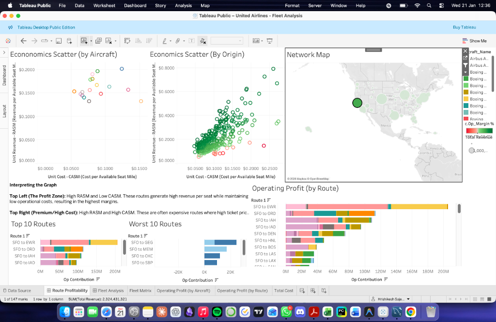
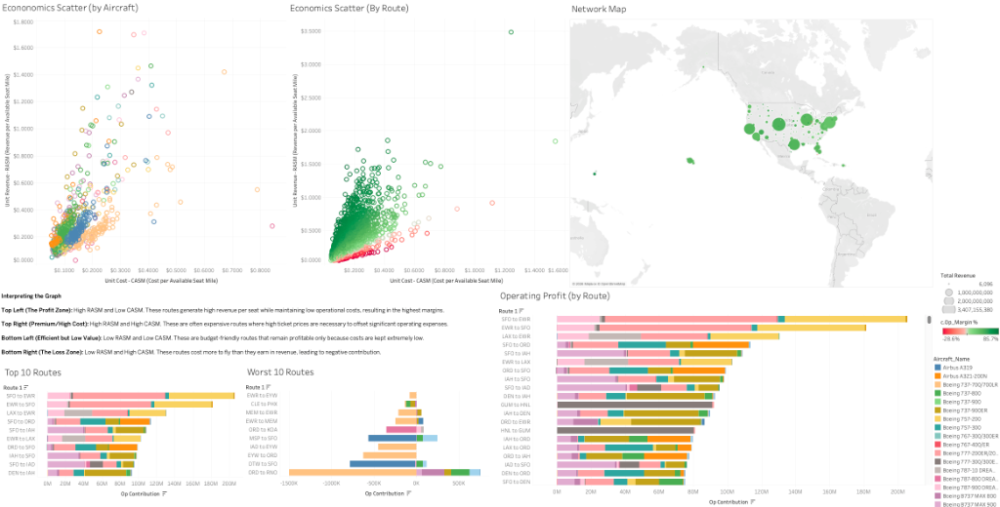

# United Airlines Route Profitability Analysis

> *An interactive diagnostic tool for analyzing network efficiency, fleet performance, and unit economics.*

**[View Interactive Dashboard on Tableau Public](https://public.tableau.com/app/profile/hrishikesh.sajeev/vizzes)**

---

##  Project Overview

This project was designed to solve a critical business problem for a mid-sized airline: **identifying which specific routes and aircraft are "bleeding cash" (Negative Operating Contribution).** By visualizing **Unit Economics (RASM vs. CASM)** and **Operating Contribution**, this dashboard moves beyond simple "Revenue" metrics to reveal true profitability. It serves as a "Hub-and-Spoke" diagnostic tool, allowing executives to drill down from a global network view to individual flight performance.

###  Key Business Questions Answered

- **Network Health:** Which hubs are driving profit, and which are dragging down margins?
- **Route Efficiency:** Which specific routes (e.g., ORD → MIA) are operating at a loss?
- **Fleet Optimization:** Is a route failing due to low demand, or because the wrong aircraft type (e.g., A320 vs B737) is being utilized?
- **Cost Analysis:** Identifying outliers where Operational Costs exceed Revenue per Available Seat Mile (RASM).

---

##  Data Pipeline

### Data Sources

This analysis uses official U.S. Department of Transportation (DoT) Bureau of Transportation Statistics (BTS) datasets:

| Dataset | Description | Purpose |
|---------|-------------|---------|
| **T100 Domestic Segment** | Flight-level operational data (passengers, seats, departures, distance) | Traffic volume & capacity metrics |
| **DB1B Market** | 10% sample of airline ticket data (fares, itineraries) | Pricing & revenue analysis |
| **Form 41 Schedule P-5.2** | Aircraft operating cost data | Hourly operational costs by aircraft type |

### Pipeline Workflow


### Python Scripts

| Script | Purpose |
|--------|---------|
| [`inspect_data.py`](scripts/inspect_data.py) | Initial data exploration and column inspection |
| [`clean_data.py`](scripts/clean_data.py) | Filters for United Airlines (UA), standardizes column names, handles data types |
| [`merge_db1b.py`](scripts/merge_db1b.py) | Merges quarterly DB1B files into a single annual dataset |
| [`process_airline_data.py`](scripts/process_airline_data.py) | End-to-end data processing pipeline |

### SQL Processing

The [`clean and merge.sql`](sql/clean%20and%20merge.sql) script performs:

1. **Data Cleaning:** Removes ferry/maintenance flights (< 20 passengers)
2. **Traffic Aggregation:** Groups by Origin, Destination, and Aircraft Type
3. **Price Calculation:** Computes weighted average fares per route
4. **Cost Integration:** Joins aircraft hourly operating costs from Form 41
5. **Final Merge:** Creates unified route financial dataset

---

##  Key Metrics & Calculations

### Financial Performance

| Metric | Formula | Description |
|--------|---------|-------------|
| **Total Revenue** | `Avg_Fare × Annual_Pax_Volume` | Gross income from ticket sales |
| **Total Ops Cost** | `Hourly_Cost × Total_Flight_Time + Landing_Costs` | Flight operations + station costs |
| **Op Contribution** | `Total Revenue - Total Ops Cost` | Net Operating Profit |

### Supply & Demand (Volume)

| Metric | Formula | Description |
|--------|---------|-------------|
| **ASM** (Available Seat Miles) | `Annual_Seat_Capacity × Distance_Miles` | Total capacity generated |
| **RPM** (Revenue Passenger Miles) | `Annual_Pax_Volume × Distance_Miles` | Total traffic volume |

### Unit Economics (Efficiency KPIs)

| Metric | Formula | Description |
|--------|---------|-------------|
| **RASM** (Unit Revenue) | `Total Revenue / ASM` | Revenue per Available Seat Mile |
| **CASM** (Unit Cost) | `Total Ops Cost / ASM` | Cost per Available Seat Mile |
| **Load Factor** | `RPM / ASM` | Percentage of seats filled |
| **Yield** | `Total Revenue / RPM` | Average fare paid per mile per passenger |
| **Operating Margin** | `(RASM - CASM) / RASM × 100` | Profitability percentage |

---

##  Technical Implementation

Built in **Tableau**, utilizing advanced data modeling and visualization techniques:


### 1. Advanced Logic & Calculations

- **Context Filters:** Applied "Add to Context" logic to fix Order of Operations errors, ensuring "Top 10 / Bottom 10" rankings calculate dynamically *after* a specific Hub is selected.
- **Set Actions:** Utilized Tableau Sets for dynamic cohort analysis that adapts to user selection.
- **String Manipulation:** Created custom "Route Keys" (`Origin + " to " + Dest`) to bridge data granularity gaps between different datasets.

### 2. Dashboard Interactivity

- **Cross-Filtering Actions:** Clicking a Hub filters the entire dashboard (Scatter Plots, Fleet Analysis, Rankings).
- **Highlight Actions:** Configured multi-dimensional highlighting—selecting a route on the scatter plot instantly highlights the specific aircraft responsible in the Fleet Matrix.

---

##  Dashboard Screenshots

### Fleet Analysis Dashboard


Key visualizations:
- **Network Map:** Hub-and-spoke visualization with size indicating revenue
- **Efficiency by Distance:** Operating margin vs. distance scatter plot
- **Operating Profit by Aircraft:** Ranked bar chart showing aircraft and route profitability
- **Fleet Utilization:** Total flight time by aircraft type
- **Unit Revenue/Cost by Aircraft:** RASM and CASM comparison charts

### Route Profitability Dashboard


Key visualizations:
- **Economics Scatter (by Aircraft):** RASM vs. CASM by aircraft type
- **Economics Scatter (by Origin):** RASM vs. CASM by hub
- **Top 10 / Worst 10 Routes:** Ranked by Operating Contribution
- **Operating Profit by Route:** Detailed route-level profitability
- **Operating Profit by Aircraft:** Ranked bar chart showing aircraft and route profitability
- **Fleet Utilization:** Total flight time by aircraft type
- **Unit Revenue/Cost by Aircraft:** RASM and CASM comparison charts
- **Network Map:** Hub-and-spoke visualization with size indicating revenue
- **Efficiency by Distance:** Operating margin vs. distance scatter plot 
---

##  How to Use the Dashboard

1. **Select a Hub:** Click on a large circle (e.g., Chicago - ORD) on the map.
2. **Identify the "Bleeders":** Look at the **"Worst 10 Routes"** chart to see the biggest money-losers.
3. **Diagnose the Cause:** Click a red dot on the **Economics Scatter (by Route)**.
4. **Pinpoint the Aircraft and the route:** Watch the **Operating Profit by Route** highlight to see the specific aircraft type underperforming on that route.

---

## Key Findings

### 1. Hub Dominance Confirms Network Strategy
As expected, United's major hubs—**Chicago-O'Hare (ORD)**, **Denver (DEN)**, **Houston-Intercontinental (IAH)**, **Los Angeles (LAX)**, **Newark (EWR)**, **San Francisco (SFO)**, and **Washington-Dulles (IAD)**—account for a disproportionately high percentage of operating margin. This validates the airline's hub-and-spoke network design, where connecting traffic through hubs maximizes operational efficiency.

### 2. Hub-to-Hub Routes Are Top Performers
The most profitable routes consistently connect one major hub to another (e.g., ORD → SFO, EWR → LAX). These routes benefit from high business travel demand, premium pricing, and efficient aircraft utilization.

### 3. Underperforming Routes Share Common Patterns
The worst-performing routes exhibit a consistent pattern:
- **Low Load Factor:** Insufficient demand to fill available seats
- **Older Aircraft:** Higher operating costs due to aging airframes
- **Fleet Mismatch:** Less efficient aircraft types deployed on routes where they underperform

### 4. Fleet Composition Heavily Favors Narrow-Bodies
The fleet is highly dependent on narrow-body aircraft, primarily the **Boeing 737 family** and **Airbus A320 family**. Wide-body aircraft such as the Boeing 777 and Boeing 787 are used on domestic routes, but these instances are relatively rare.

### 5. Older Airframes Have Higher Unit Costs
A clear trend emerges in the Unit Cost by Aircraft analysis: older variants of the 737 and A320 families exhibit higher CASM values. This is likely due to lower fuel efficiency and higher maintenance costs associated with aging airframes.

### 6. Load Factors Meet Industry Benchmarks
The average load factor across the fleet exceeds **80%**, which aligns with industry standards for domestic operations and indicates effective capacity management.

### 7. Wide-Bodies Excel on Long-Haul Routes
When deployed on longer-distance flights, wide-body aircraft demonstrate improved efficiency metrics. Their higher fixed costs are offset by the ability to spread those costs over greater distances.

---

## Limitations

### 1. Cargo Revenue Data Unavailable
The analysis excludes cargo revenue and volume data. This limitation **may skew results toward favoring narrow-body aircraft**, as wide-body aircraft typically use their larger cargo holds to offset higher operating costs. 

However, the impact may be mitigated by the fact that most wide-body aircraft configured for domestic routes use **high-density seating configurations**, prioritizing passenger capacity over cargo space.

### 2. Data Sample Limitations
- The DB1B dataset represents a **10% sample** of airline tickets, which may not capture all route-level fare variations
- Award tickets (frequent flyer redemptions) are included but valued at their nominal fee rather than equivalent cash fares

---

##  Repository Structure

```
├── README.md                    # This file
├── scripts/                     # Python data processing scripts
│   ├── clean_data.py           # Main data cleaning pipeline
│   ├── merge_db1b.py           # DB1B quarterly merger
│   ├── process_airline_data.py # End-to-end processing
│   └── inspect_data.py         # Data exploration utility
├── sql/                         # SQL queries
│   └── clean and merge.sql     # MySQL data transformation
├── dashboards/                  # Dashboard screenshots
│   ├── fleet_analysis_dashboard.png
│   └── route_profitability_dashboard.png
├── data/                        # Sample data (not included)
│   └── .gitkeep
└── docs/                        # Additional documentation
    └── .gitkeep
```

---

##  Setup & Requirements

### Python Dependencies

```bash
pip install pandas
```

### Database Requirements

- MySQL 8.0+ (or compatible)
- Tableau Desktop (for dashboard development)
- Tableau Public (for sharing)

### Data Requirements

Download the following datasets from [BTS TranStats](https://www.transtats.bts.gov/):

1. **T-100 Domestic Segment (US Carriers Only)** - 2024
2. **DB1B Market Survey** - 2024 Q1-Q4
3. **Form 41 Schedule P-5.2** - Aircraft Operating Expenses

---

##  Links

- **Tableau Public Dashboard:** [View Interactive Dashboard](#) *(Add your Tableau Public link)*
- **BTS TranStats:** [https://www.transtats.bts.gov/](https://www.transtats.bts.gov/)

---

##  Author

**Hrishikesh Sajeev**

- [LinkedIn](https://www.linkedin.com/in/hrishikeshsajeev05/)
- [Portfolio](https://portfolio-alpha-nine-1c5as202t8.vercel.app)

---

##  License

This project is for educational and portfolio purposes. Data sourced from the U.S. Department of Transportation Bureau of Transportation Statistics.

---

*Created with Python, MySQL, and Tableau Desktop | Data Source: U.S. BTS TranStats*
